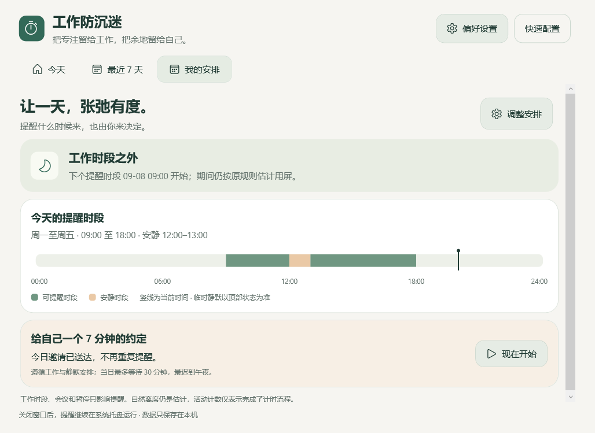

# 工作防沉迷 · WorkGuard

给专注留一点空隙。一个本地运行的 Windows 休息提醒工具，帮助长期电脑工作者打断连续用屏与静态姿势。

**0.8.0 简洁休息体验（预发布）** · C# / .NET 10 / WPF · 无账户、无服务器、无广告、无应用遥测

## 下载试用

[GitHub Releases 下载](https://github.com/yearliny/workguard/releases) · [自动构建](https://github.com/yearliny/workguard/actions) · [验证记录](docs/VERIFICATION.md)

| 文件 | 适合谁 | 运行条件 |
| --- | --- | --- |
| `WorkGuard-版本-win-x64-lite.zip` | 已安装或愿意安装运行时 | 需要 [.NET 10 Desktop Runtime x64](https://dotnet.microsoft.com/download/dotnet/10.0) |
| `SHA256SUMS-win-x64.txt` | 校验下载文件 | 精简 ZIP 的 SHA-256 |

从 0.2.0 起，Releases 只发布精简版。请完整解压到目录后运行 `WorkGuard.exe`，不要只复制 exe。Windows 自带的 .NET Framework 不能替代 .NET 10 Desktop Runtime。

仓库目前为私有，需要登录具有仓库访问权限的 GitHub 账户。Releases 的文件不受 Actions 构建产物的 30 天保留策略限制；删除 Release 或资产仍会使下载失效。

## 0.8.0 简单清楚地休息

全屏页面突出当前动作、一句指导与数字倒计时；底部细进度线显示整场剩余时间。四幅透明矢量场景融入页面背景，轻量按钮保留键盘焦点和操作反馈。暂停、跳过、安静替代与多显示器仍使用同一计时源。

## 0.7.0 专注有时，休息有约

- 「我的安排」展示今日 24 小时时间轴、工作时段、安静时段，以及当前静默原因；首页与托盘使用相同的提醒状态。
- 可选择一周中的工作日及起止时间，支持跨午夜班次。默认关闭，升级保持原来的全天提醒。时段外只暂停自动提醒，不因时段切换清零连续计时；手动休息随时可用。
- 每日一次 7 分钟预约，到点轻提醒，由你点击开始；强制模式也不会自动启动 7 分钟活动。遵循会议、全屏、暂停、离席和工作时段。预约后当日 30 分钟内等待，最迟到午夜，错过不追补。
- 邀请送达前保存当天标记；重启、同日更改预约时间、时钟回拨不会重复。当天已经完成 7 分钟活动则不再邀请。点击「今天略过」或 40 秒自动收起不授予活动次数。
- 结束静默后留出 15 秒恢复缓冲，期间显示倒计时；睡眠、长卡顿不补算缓冲。已到期的强制休息在缓冲结束后才开始。
- 无新增图片、运行时或联网依赖；新增 15 项确定性行为测试，以及 Windows 控制器预约与保存失败检查。



## 0.6.0 从容开始，清楚结束

- 三步快速引导，说明温和与强制模式的差异，返回修改保留选择；保存失败可原地重试。
- 已有用户可从概览进入快速配置，保留自定义周期及未展示的高级偏好；未保存时不更改设置。
- 身体活动页显示当前和接下来最多三个环节、各自时长，安静休息替代不再展示动作路线。
- 完整结束后，概览显示两分钟的轻量反馈；眼睛 / 强制休息仍自动返回工作。
- 跳过的流程显示实际活动时间和进度，不再显示完整完成圆环与勾号。
- 沿用现有插画和原生动效，不增加图像资产或运行时依赖。


## 0.5.0 安静、精致的桌面体验

- 新的离线拱廊远景插画；首页节奏环、留白与信息层级重排，明确显示当前提醒模式。
- 休息页采用场景与引导分区，圆环呈现当前动作进度，颜色随场景过渡；窄窗口自动收起装饰画。
- 页面进入、按钮悬停 / 按下、动作切换、背景色与进度使用短时缓动，不循环播放背景动画。
- 「设置 → 减少打扰 → 减少动态效果」关闭动画；同时遵循 Windows 客户区动画设置。动画不决定计时、完成或关闭时机。
- 最近七天增加真实最长连续工作柱图；缺失日期显示破折号，不编造记录。
- 强制休息、紧急退出、自然离席及本地数据规则保持有效。


截图来自本次 PR 的 Windows 界面验证。

## 0.4.0 强制休息

在「设置 → 强制休息」开启模式并保存。已有用户升级后仍保持原来的温和模式；可先点击「体验 20 秒强制全屏」。

- 到点直接全屏并开始计时：身体活动 3 分钟，眼睛远眺 20 秒（可单独取消强制）。手动 7 分钟活动仍由用户发起。
- 普通跳过、暂停、推迟按钮不出现；Esc / Alt+F4 打开紧急退出确认，确认后释放所有窗口，5 分钟后再提醒，不计完成。
- 全部已连接显示器显示休息页，使用一个计时源。完成后自动关闭；显示器配置改变时释放窗口，以免遗留遮罩。
- 远眺、离座、肩颈、手腕四类场景配色与引导轮换。插画复用本地资源，不增加联网或视频依赖。
- 温和转头需单独开启，默认关闭。动作不适合可改为安静休息，保留剩余时长；完成仅记一次眼睛休息，不增加身体活动次数，也不清零身体暴露。
- 会议模式、安静时段、提醒暂停和全屏静默规则继续有效；不会强行打断这些状态。
- 锁屏、睡眠或长计时间隙暂停活动，回来后需点击继续，不补算活动时长。

这是用户主动开启的工作约束，不是 Windows 安全锁屏；不会拦截系统快捷键、任务管理器或系统退出，也不能验证用户实际完成了动作。


## 0.3.0 视觉更新

- 两幅本地透明插画：工位小休息、窗外远景。首页、设置、轻提醒和活动准备 / 完成状态使用统一风格。
- 图标导航、带图标的统计卡片、独立的眼睛 / 办公室活动入口，配合鼠尾草绿、暖米色与杏橙色点缀。
- 设置开关与输入框统一样式；保留文字标签、原有快捷键和可见焦点。
- 普通活动进行时隐藏插画，突出计时与动作说明；操作按钮和退出始终处于固定位置。
- Windows 11 优先使用系统 Segoe Fluent Icons，Windows 10 使用 Segoe MDL2 Assets；不捆绑图标字体或新的 UI 框架。
- 插画嵌入程序且限尺寸解码，无需网络。精简包因本地图片有所增大，仍不捆绑 .NET 运行时。


截图为 Windows 原生界面，使用 CI 演示数据。

[视觉素材、来源与生成说明](docs/VISUAL-ASSETS.md)

## 已实现

- 系统托盘常驻，关闭概览不会退出；托盘菜单可退出。
- 默认 20 分钟提醒远眺 20 秒，60 分钟提醒活动 3 分钟，提前 10 分钟轻提示。
- 7 分钟办公室活动，手动发起；轻柔版本默认开启，可选择包含基础力量动作的版本。
- 温和模式的自动提醒在屏幕角落出现，不抢键盘焦点，40 秒后自动收起并推迟 5 分钟。主动开始身体活动后才全屏。
- 普通倒计时支持暂停、跳过、Esc 退出；提供下一动作预告，可关闭切换和结束提示音。
- 键鼠空闲估计、锁屏 / 解锁、睡眠 / 唤醒、会话断开 / 连接。
- 全屏应用静默、手动会议模式、每日安静时段（支持跨午夜）、暂停提醒一小时、推迟五分钟。
- 设置分为休息节奏、强制休息、减少打扰、通用与数据；提供日常 / 专注预设，保存出错时留在当前页面。
- 今日概览与七日统计分开呈现；可导出最近九十天 CSV，按本地日期分配跨午夜的活跃时间。
- 开机启动可选；重复启动唤起概览，跨 Windows 会话避免并发写入同一数据文件。
- 单实例、强制模式多显示器覆盖层、PerMonitorV2 DPI 声明；显示器变化时关闭休息窗口。
- 原子写入与上一版本备份；异常或较新版本数据以只读方式保护，提供显式恢复备份，保留恢复前原文件。
- 保存失败持续显示提示，本地诊断日志记录故障类型与调用栈，不自动上传。
- 60 项核心行为测试；Windows 原生窗口、交互及发布包检查；CI 保存界面截图并自动发布精简包。

## 如何运行

兼容目标：Windows 10 22H2 / Windows 11 x64。ARM64 可自行构建，尚未实际验收；Windows CI 也不替代这两个目标系统的人工验收。

Windows 10 22H2 是本项目的兼容目标，并非 .NET 10 的官方受支持系统承诺；微软的支持矩阵按 Windows 生命周期区分版本，见 [官方系统列表](https://github.com/dotnet/core/blob/main/release-notes/10.0/supported-os.md)。

安装 .NET 10 Desktop Runtime x64，完整解压 `WorkGuard-0.8.0-win-x64-lite.zip` 后运行 `WorkGuard.exe`。请保留目录中的所有文件。当前没有代码签名、安装器或自动更新。更新前先从托盘退出旧版本，再完整解压新版本；设置和统计会继续使用原数据目录。

首次启动显示三步快速引导：选择节奏、提醒力度，再确认保存。保存前不会自动弹出休息；直接关闭引导可稍后从概览的“快速配置”继续。保存后从系统托盘使用。系统托盘图标可能在折叠菜单中。建议先手动尝试 20 秒、3 分钟、7 分钟流程。

源码运行需要 [.NET 10 SDK](https://dotnet.microsoft.com/download/dotnet/10.0)：

```powershell
dotnet run --project tests/WorkGuard.Tests -c Release
dotnet run --project src/WorkGuard.Windows
```

测试项目是无需第三方依赖的可执行行为测试程序，**使用 `dotnet run`，不是 `dotnet test`**。Windows 界面只能在 Windows 上运行；Core / Data 测试可在 Linux 上运行。

```powershell
# Windows 上构建、验证界面并打包
dotnet build WorkGuard.slnx -c Release
./scripts/smoke-windows.ps1
./scripts/publish.ps1

# 只构建需要预装运行时的精简版
./scripts/publish.ps1 -Mode lite

# ARM64 构建（需要在 ARM64 机器上验收）
./scripts/publish.ps1 -Runtime win-arm64
```

每次推送 `main` 或打开 PR 都会运行 CI。构建成功后，在 Actions 对应运行的 Artifacts 下载精简包和 windows-ui 截图。CI 在测试、Windows 发布包检查通过后，按项目 Version 自动发布预发布版到 Releases，保持仓库现有可见性。同版本已发布后不会覆盖；发布下一版需要提升项目 Version。

## 计时规则：避免错误的“休息信用”

| 情况 | 累计用屏 / 工作估计 | 清零连续计时 | 提醒 |
| --- | --- | --- | --- |
| 最近一分钟有输入 | 是 | 否 | 正常 |
| 空闲 1 分钟至自然休息阈值 | 暂停估计 | 否 | 不弹 |
| 空闲达到阈值，默认 5 分钟 | 否 | 是，属于启发式估计 | 不弹 |
| 关闭自然休息推测 | 是 | 仅显式休息 / 锁屏离席 | 正常 |
| 会议模式 / 全屏静默 | 是，即使无输入 | 否 | 静默 |
| 安静时段 / 暂停提醒 / 推迟 | 仍按正常规则计时 | 不因暂停而清零 | 暂停 |
| 锁屏、睡眠、会话断开 | 否 | 持续达到自然休息阈值后 | 不弹 |
| 完成 20 秒眼睛休息 | 不计工作 | 只重置眼睛计时 | 身体活动仍可到期 |
| 完成 3 / 7 分钟活动 | 不计工作 | 同时重置身体和眼睛计时 | 重新开始 |
| 跳过、退出、不足时长 | 不授予完整活动 | 不因退出而清零 | 推迟 5 分钟 |
| 未解释的定时器长间隙（超过 10 秒） | 不补算 | 不自动当作休息 | 运行中的活动暂停 |

键鼠空闲无法证明人离开屏幕，锁屏也无法证明身体正在运动。因此界面使用“估计”，不会声称验证姿势或动作。阅读场景建议关闭自然休息推测；会议请手动开启托盘中的会议模式。重启后保留日统计，但不恢复连续计时，因为关闭期间是否休息不可知。

## 数据与安全边界

数据目录：`%LOCALAPPDATA%\WorkGuard`。`state.json` 保存设置和每日汇总；`state.json.bak` 保存上一次成功写入的版本。每 30 秒、活动完成、保存设置和退出时写入。意外终止可能丢失最近 30 秒记录。

不采集按键内容、鼠标轨迹、截图、窗口标题、进程使用历史、摄像头、麦克风。故障诊断仅记录时间、版本、异常类型、错误码和代码调用栈，不记录异常消息或用户文件内容。全屏检测只临时读取前台窗口句柄、PID 和边界。应用不主动联网。详见 [隐私说明](docs/PRIVACY.md)。

身体活动提示不是康复处方，默认周期也不是医学强制标准。动作应以舒适为准；已有疾病、伤病或近期手术时遵循专业建议。内容依据与证据边界见 [健康内容说明](docs/HEALTH-CONTENT.md)。

## 当前边界

- 普通身体休息覆盖鼠标所在显示器；强制模式覆盖已连接显示器，紧急退出需确认。系统快捷键不受拦截。
- 已有每周工作时段和每日 7 分钟预约；未实现自动会议识别、工位体检或外部日历接入。
- 暂无动作教学动画 / 语音、自动更新、安装器、代码签名。活动采用文字指引和下一步预告。
- 全屏检测为窗口尺寸启发式；无边框窗口、特殊窗口管理器等场景需要实机验证。
- 统计是完成流程次数，不能证明做了动作、离开座位或健康改善。自然离席不增加完成次数。
- 最长连续时间按当天观察到的连续会话累计值记录，跨午夜会话可能包含前一天部分；不是每日平均。
- 暂无对休息周期的医学有效性验证，也不展示健康评分或卡路里估算。

## 结构

| 项目 | 职责 |
| --- | --- |
| `WorkGuard.Core` | 纯计时与提醒决策、活动流程、可注入时间 |
| `WorkGuard.Data` | 本地 JSON 原子持久化、版本保护、日汇总 |
| `WorkGuard.Windows` | WPF 界面、托盘、Windows API、会话与电源事件 |
| `WorkGuard.Tests` | 计时边界、活动完成语义、持久化异常行为测试 |

当前采用 JSON 而非 SQLite：只有一个进程和小型每日汇总，先减少部署依赖。未来需要逐条事件分析或更复杂查询时再迁移。

验收步骤见 [Windows 验收清单](docs/WINDOWS-ACCEPTANCE.md)，开发约束见 [AGENTS.md](AGENTS.md)，后续优先级见 [ROADMAP.md](docs/ROADMAP.md)。
